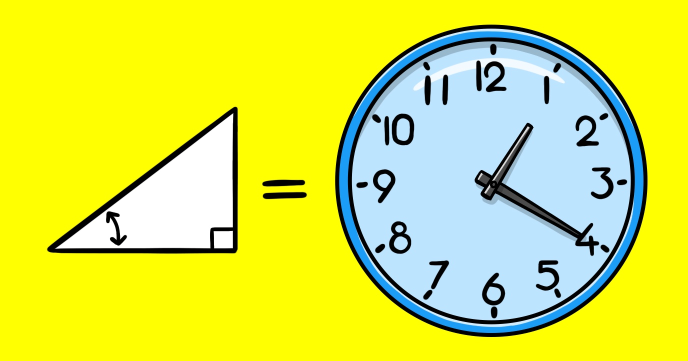

With all the digital gadgets around us, analog clocks represent a classical beauty. 

Learn how to re-create one with our tutorial and a little bit of trigonometry. You’ll learn:

-	How to work with Dates in JavaScript
-	How to convert from cartesian to polar coordinates
-	How to translate one value from an interval to another
 
## Source code 
The JavaScript source code of this program can be found [here](sketches/program.js). To run it, you need to import it in the [codeguppy.com](https://codeguppy.com) online editor. Alternatively, you can use the source code in your p5.js sketches (advanced use). 
## Online version 
To see the code running, check the online playground at [https://codeguppy.com/code.html?t=clock](https://codeguppy.com/code.html?t=clock) 
## Next steps 
Please check [codeguppy.com](https://codeguppy.com) for many other fun JavaScript programs and games for beginners. To stay up to date with CodeGuppy development please follow [@codeguppy](https://twitter.com/codeguppy) on Twitter.  
